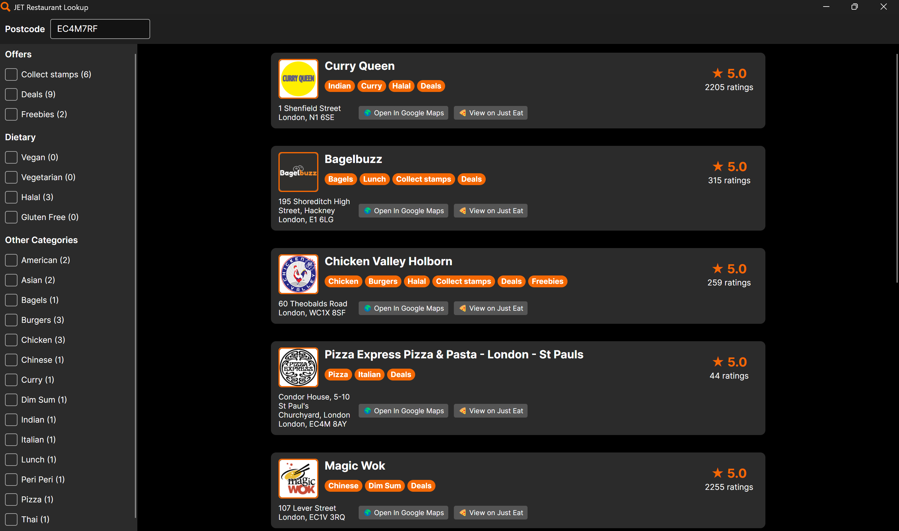
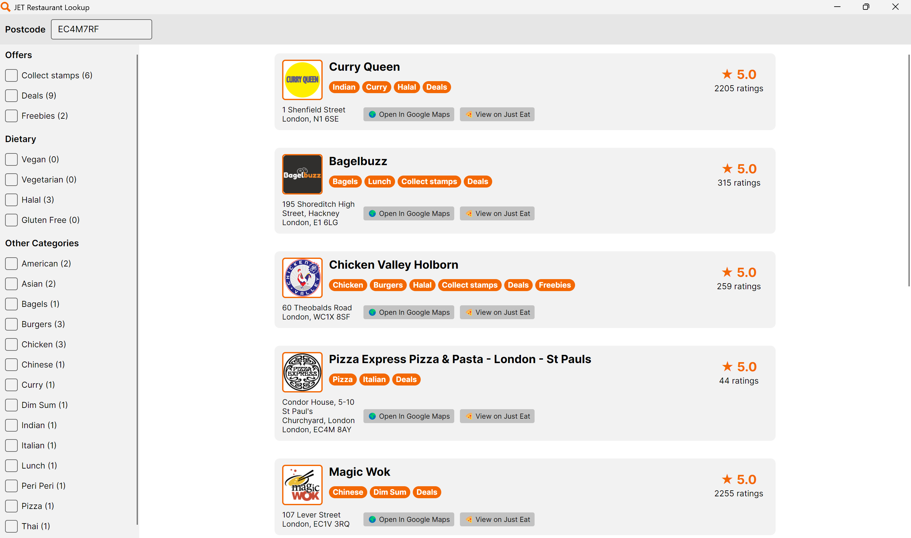

<p align="center">
    
</p>

# JET Restaurant Lookup
Search for restaurants near any UK Postcode using the Just Eat API!

A coding assignment for the Early Careers Software Engineering Program at Just Eat Takeaway.

## Table of Contents
- [Features](#features)
- [UI](#ui)
- [Downloads](#downloads)
- [Building from Source](#building-from-source)
- [Design & Architecture](#design--architecture)
- [Challenges & Assumptions](#challenges--assumptions)
- [Future Improvements](#future-improvements)


## Features
- View the name, address & rating of 10 restaurants near any uk postcode.
- Filter by dietary options (e.g. "Vegan"), special offers (e.g. "Freebies"), and cuisine types (e.g. "Italian").
- Open restaurants on Google Maps or [just-eat.co.uk](https://www.just-eat.co.uk)

## UI
The app's theme automatically matches the user's system theme.
### Dark Theme

### Light Theme


## Downloads
Downloads are available on the [latest release page](https://github.com/DavidGBrett/JetRestaurantLookup/releases/latest). We currently provide Windows releases only.

Each release includes JetRestaurantLookup.exe as a self-contained single-file executable with the runtime and required dependencies bundled.

Because the app is unsigned, Windows may show a warning. Click **More info**, then **Run anyway**.

## Building from Source

### Prerequisites
**.NET 10 SDK** is required to build, run, and test this project from source.
- **Download:** [.NET 10 SDK](https://dotnet.microsoft.com/en-us/download/dotnet/10.0)
- **Verify installation:**
  ```bash
  dotnet --version
  ```
  Should show 10.0.xxx or higher.

### Commands
Run these in the terminal from the repository root

| Task | Command |
|------|---------|
| **Build** | `dotnet build` |
| **Run** | `dotnet run --project JetRestaurantLookup` |
| **Test** | `dotnet test` |

### Note
This project has only been tested on Windows

## Design & Architecture
The solution is split into three projects to keep concerns separated:

- **JetRestaurantLookup** – UI layer (Avalonia views and view models)
- **JetRestaurantLookup.Core** – core logic (services, models, DTOs, utilities)
- **JetRestaurantLookup.Tests** – unit tests

The application follows the MVVM pattern, with view models handling state and user interactions while keeping the UI layer lightweight.

External API interaction is encapsulated behind `IRestaurantService`, isolating HTTP and API-specific concerns from the rest of the application. The service depends on an injected `HttpClient`, which allows it to be easily tested using mocked HTTP responses without making real network calls.

A mapping layer is used to convert API DTOs into domain models. While the models are currently very similar to the DTOs, this separation was intentional to avoid coupling the rest of the application to the API response structure and to make future changes easier to accommodate.

Some presentation-specific logic (such as filtering and categorization) is handled in the view model, keeping it close to where it is used without introducing unnecessary complexity into the core layer.

## Challenges & Assumptions
A key challenge in this project was the lack of clear documentation for the specific API endpoint used. While general documentation exists at [Just Eat UK API Docs](https://uk.api.just-eat.io/docs), it does not, as of now, cover the ``discovery/uk/restaurants/enriched/bypostcode`` endpoint. As a result, the response structure had to be inferred through experimentation.

Based on testing, the required fields (e.g. name, address, rating) appeared consistently. The application is therefore designed around the assumption that this schema is stable and that these fields are always present.

Categorizing cuisines also required some interpretation. The API returns a mix of actual cuisines and tag-like values (e.g. Vegan, Freebies), so these were grouped manually into dietary, offer, and other categories. The "other" category is intentionally used instead of "cuisines" to keep the system flexible, ensuring that any unrecognized or new values are still displayed without being incorrectly labelled. This improves robustness, but relies on a predefined set of known values for the dietary and offer groupings.

For postcode handling, the application takes a flexible approach. User input is normalized and sent to the API rather than being strictly rejected upfront, allowing for potential new or uncommon postcode formats. If no results are returned, the input is then checked against the official UK postcode regex, and the user is prompted to verify it if it appears invalid.

## Future Improvements
There are several areas where the application could be improved or extended.

The UI could be further refined and polished, with general improvements and additional elements such as icons for cuisines and categories.

Filtering and search could be extended to include searching by restaurant name and filtering by rating.

Location input could be improved beyond manual postcode entry, for example by allowing selection on a map or automatic location detection.

Support for other platforms (e.g. Linux and macOS) could be added. The application is currently only tested on Windows and only a Windows executable is provided in releases.